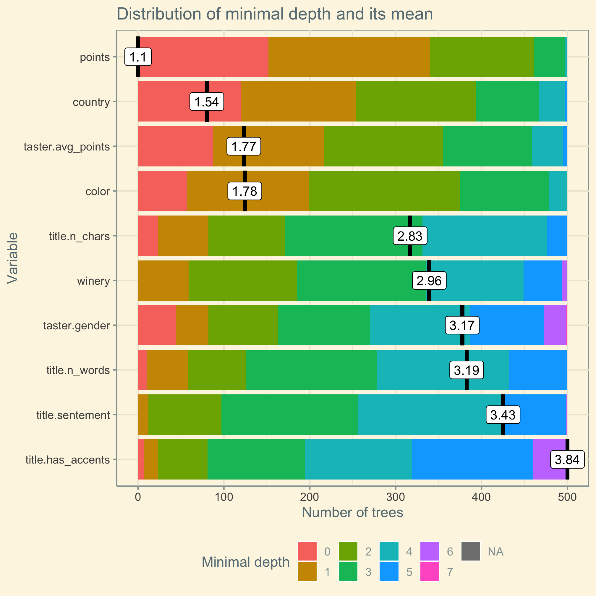

background-image: url(https://camo.githubusercontent.com/06e0a35a7e3014fe8c7f009d2f6bfacf14cefa93/687474703a2f2f6761727265747468617765732e636f6d2f722f636f7665722e6a706567)
background-position: center;
background-repeat: no-repeat;
background-size: contain;      /* applied using JavaScript only if background-image is larger than slide */
class: overview

# PROJECT OVERVIEW

.pull-left[
- <a href="https://github.com/hawesg/BUS696-final-project"><i class="fab fa-github-alt"></i> Github Code Base</a> 
- Data Cleaning, Feature Generation and Exploritory Data Analysis <a href="http://bus696.garretthawes.com/deliverable-2/index.html">Deliverable</a>
]
.pull-right[]
```{r setup, include=FALSE}
options(htmltools.dir.version = FALSE)
```
```{r global_options, include=FALSE}
# library(svglite)
library(knitr)
library(kableExtra)
# library(emojifont)
# source(here::here("code","1.libraries.R"))
# This is a way to set options for all code chunks at once
# Note that you can also dynamically control options by setting them to a value
# DPI setting increased for Word output, cairo is anti aliasing
knitr::opts_chunk$set(dev='png')
knitr::opts_chunk$set(fig.retina=4)
# knitr::opts_chunk$set(cache=TRUE)
model.comparison <- data.table()
```
```{r xaringan-themer, include = FALSE}
library(xaringanthemer)
solarized_light(
  code_font_family = "Fira Code",
  code_font_url = "https://cdn.rawgit.com/tonsky/FiraCode/1.204/distr/fira_code.css"
)
theme_set(theme_solarized())
```

---
class: inverse
background-image: url(wine-heartbeat.svg)
background-size: contain

# TODAY'S AGENDA

- DATA
  - Source data sets
  - Cleaning 
  - Feature Generation and transformations
  - Exploratory Data Analysis
  - Preprocessing and Train/Test split
- MODELING THE DATA
  - Stepwise Feature Selection
  - Linear Regression
  - Elastic Net 
  - Bootstrapping 
  - Random Forest
  - Logistic Regression
- SUMMARY
  - Model comparison
  - Future Work

---

# OVERVIEW OF BUSINESS PROPOSITION


We are trying to accurately model the price of wine utilizing several variables connected with the winemaking process.  In this dataset, the majority of the wines surveyed fall below $100, but there are notable exceptions.  This sort of model has many applications that can be directly applied to numerous businesses and ventures.  Below are some industries and vocations that could benefit from such a model. Examples of potential use cases are:

- Restaurant Owner: Sell Wine For Larger Markup
- Wine Speculator: Naturally Can Make Bigger Profits
- Wine Distributor: Can Know What Wines Not To Sell
- Winery Owner:  Shift Focus To Higher Margin Grape Varieties
 
---

class: inverse, middle, center
background-image: url(wine-bottles.svg)
background-size: contain

# DATA

---

# KAGGLE

#### The original [data from Kaggle](https://www.kaggle.com/zynicide/wine-reviews) included 14 coulmns 

.pull-left[
- `#`: A numeric id from 0-130,000
- `country`: The country that the wine originated
- `description`: The body of the review
- `designation`: The vineyard within the winery where the grapes that made the wine are from, ie: Reserve Harvest
- `points`: The number of points WineEnthusiast rated the wine on a scale of 1-100*
- `price`: The cost in USD for one bottle
- `province`: The province or state that the wine originated
- `region_1`: The wine-growing area in a province or state (ie Napa)
]
.pull-right[
- `region_2`: Sometimes there are more specific regions specified within a wine-growing area (ie Rutherford inside the Napa Valley), but this value can sometimes be blank
- `taster_name`: The name of the reviewer
- `taster_twitter_handle`: The twitter handle of the reviewer
- `title`: The title of the wine
- `variety`: The type of grapes used to make the wine (ie Pinot Noir)
- `winery`: The winery that made the wine
]

.footnote[<i class="fad fa-asterisk"></i> The lowest score in the data set was 80]

---
class: twitter

# TWITTER

- We pulled data from the twitter profiles of each of the reviewers like gender, amount of tweets, number of followers, etc. 
- The underlying assumption is that reviewers who were prolific on social media might be more generous with their assigned points than those who weren’t.
- Additionally, they may behave differently on gender lines. 

<!--  -->

```{r echo=FALSE}
DT::datatable(
twitter_stats,
fillContainer = FALSE, 
options = list(pageLength = 6),
rownames = FALSE,
colnames = c('Twitter Handle', 'Number of Tweets', 'Number of Followers', 'Gender'),
caption = htmltools::tags$caption(
    style = 'caption-side: bottom; text-align: center;',
    '*', htmltools::em('twitter.csv pulled from twitter 10/01/19')
) )
 # knitr::kable(head(twitter_stats), format = "html")
```

---
class: wine-color

# WINE COLOR

- The original data set included the variety of the grape but not the color of the wine. 
- A group of colors was assigned via regular expressions ie: all varieties matching `REGEX` were classified as red. Validation was done of each of the matches to make sure there were no false positives.
- The rest was done manually with the aid of a google sheet document that auto-populated with thumbnails from google image search. Afterward, this data was imported and left joined to the data set.

.center[  ]

---

# DATA CLEANING

- Various encoding issues were fixed with the text columns, NA values were removed from price and columns were converted to character where blank implies that there was none (ie: designation).
- Wines with missing countries were removed, as were wines missing a grape varietal and taster name.
- Some columns were converted to charecter vectors to make them easier to work with.

```{r data-cleaning, eval=FALSE, message=TRUE, warning=FALSE}
wine_data <- wine_data %>% 
  dplyr::mutate( country = as.character(country), 
                 variety = as.character(variety), 
                 taster_name = as.character(taster_name), 
                 color_lump = fct_lump(color, n = 2), 
                 province_lump = fct_lump(province, n = 25), 
                 country_lump = fct_lump(country, n = 25) ) %>% 
  dplyr::filter (country != "" & variety != "" & taster_name != "") %>% drop_na(price) 
```

---
class: features
# FEATURE GENERATION

#### Several columns were added to help get a better picture of the data.

- Reviews were grouped by points into "Not Recommended", "Mediocre", "Good", "Very good", "Outstanding” and "Classic” as per the wine spectator website. 
- Sentiment Analysis was performed on the title of the wine
- Additional title-based features included number of characters, number of words and whether the title included any accents (as a metric of whether the wine seemed exotic and foreign in the American market).
- Wine designation was grouped into more broad categories ie: any wine that included a variation of the word reserve(reserva, riserva, reserve, estate reserve, etc…) were renamed reserve this was done with the aid of `grepl`, `stringr` and `stringi`. `wordcloud` was useds to identify target groups. 
.pull-left[
```{r wordcloud, echo=FALSE, dev="png"}
par(bg = '#fdf6e3')
wordcloud(
  words = wineDesignation.clean,
  min.freq = 2,
  max.words = 200,
  random.order = FALSE,
  rot.per = 0.35,
  colors = brewer.pal(8, "Dark2")
)
```
]
.pull-right[
```{r sentement, echo=FALSE}
# par(bg = '#fdf6e3')
# qplot(s$ave_sentiment, geom="histogram",binwidth=0.2,main="Wine Title Average Sentiment Histogram")
ggplot(s, aes(x=ave_sentiment))+
  geom_histogram(color="darkblue", fill="lightblue", bins = 10) + 
  labs(y="", x="Average Sentiment", title="Distribution of Sentiment Scores")
```
]

---

# FEATURE GENERATION

- `n` for `fct_lump` for the various factor columns according to a parameter set at the beginning of main.R or on the command line. 
- Parameters are `by_count`, `taster_name`, `taster_twitter`, `designation`, `country`, `variety`, `variety.red`, `variety.white`, `province`, `winery`

```{r feature-generation, eval=FALSE, message=TRUE, warning=FALSE}

FCT_LUMPS <- list( by_count = 0, ..., winery = 15)
```

- `by_count` supersedes the other parameters in that setting it will cause `fct_lump` based on how many observations there are with any given feature.

```{r feature-generation-2, eval=FALSE, message=TRUE, warning=FALSE}
if (FCT_LUMPS$by_count != 0) {
  fct_x <- .number_of_factor_levels_containing_num_observations 
  FCT_LUMPS[['taster_name']] <-
    fct_x(wine_data$taster_name, FCT_LUMPS$by_count)
  FCT_LUMPS[['taster_twitter']] <-
    fct_x(wine_data$taster_twitter_handle, FCT_LUMPS$by_count)
  ...
}
```

---
class: maps

# EXPLORATORY DATA ANALYSIS

- As you can see there are distinct patterns that emerge when looking at both price and review scores broken down by country.

```{r maps, echo=FALSE, fig.height=5, fig.show='hold', out.width=c('50%', '50%')}
.map_from_attribute("point_avg", "Average Points")
.map_from_attribute("price_avg", "Average Price")
```

---
class: marginal

# EXPLORATORY DATA ANALYSIS

.pull-left[
```{r marginal-price, echo=FALSE, dev='png'}
plot.ggmarginal.price.p1 
# plot.marginal.plot.1
``` 
]
.pull-right[
```{r marginal-price-logged, echo=FALSE}
plot.ggmarginal.log.p1
```
]

---
class: exploritory

# EXPLORATORY DATA ANALYSIS

.pull-left[
```{r price-by-country, echo=FALSE, dev="png"}
plot.price_by_country + theme(legend.position = "bottom")
```
]
.pull-right[
- Distribution of price is not well distributed in the original data as you can see from the previous slide, scaling the price to log base 10 with `scale_y_log10` and `coord_flip()` taking the log of price makes the data more reasonable.

```{r eval=FALSE, message=FALSE, warning=FALSE}
ggplot(wine_data_clean, aes(x = country_lump, 
  y = price, color = cat)) + 
  coord_flip() + scale_y_log10() + #<<
  geom_jitter(alpha=1/2) + 
  labs(color = "Rating Category", 
       title="Price by Country", 
       caption="Price is scaled to log 10", 
       x="Country", y="Price")  + 
  theme(plot.title = element_text(hjust = 0.5), 
        legend.key=element_rect(fill='#fdf6e3'),
        legend.box.background = 
          element_rect(colour = "#fdf6e3")
  )
```
]

---

# TRANSFORMING Y - TUKEY'S LADDER OF POWERS 

- Sometimes called the Bulging Rule, a way to change the shape of a skewed distribution so that it becomes normal or nearly-normal

.pull-left[
```{r tukey-lambda}
transformTukey(sample(prices, 5000), 
               plotit=FALSE, 
               returnLambda = TRUE)
```
$$ -1 \cdot \frac{1}{price^{0.3}}$$
]
.pull-right[
```{r tukey-histogram, echo=FALSE, fig.height=5}
par(bg = '#fdf6e3')
plotNormalHistogram(Tukey, col = "#93a1a1")
```
]

---

# DATA PRE-PROCESSING

- The preprocess function in `CARET` was used to transform independent numeric values into more standardized variables 


```{r pre-process, eval=FALSE}

wine_data_to_be_standardized <- wine_data_clean %>% 
  select( points, title.n_words, title.sentement, title.n_chars, taster.avg_points, 
          taster.n_reviews, taster.n_tweets, taster.n_followers)
preprocessParams <-
  preProcess(wine_data_to_be_standardized[, 1:8], method = c("center", "scale")) #<<
print(preprocessParams)

transformed <-
  predict(preprocessParams, wine_data_to_be_standardized[, 1:8])
summary(transformed)
head(transformed)
wine_data_standardized <- bind_cols(wine_data_not_to_be_standardized, transformed)

```

---
class: exploritory

# EXPLORATORY DATA ANALYSIS

- As you can see centering and scaling increases the correlation between price as well as the transforming the dependent variable with $-1 \cdot price^{-0.3}$

.pull-left[
```{r ggpairs, echo=FALSE, message=FALSE, warning=FALSE, fig.width=10}
ggpairs.variables <- c("price", "points", "title.n_chars", "title.has_accents")
wine_data_tukey_non_scaled <- wine_data_clean %>% mutate(price = -1 * price^(-0.3))

ggpairs(wine_data_clean, columns = ggpairs.variables,
        ggplot2::aes(color=color, alpha=.2))

```
]
.pull-right[
```{r ggpairs-standardized, echo=FALSE, message=FALSE, warning=FALSE, fig.width=10}
# ggpairs.variables <- c("price", "points", "title.n_chars", "title.has_accents")

ggpairs(wine_data_standardized_tukey, columns = ggpairs.variables,
        ggplot2::aes(color=color, alpha=.2))
```
]

---

# TEST/TRAIN SPLIT

- The createDataPartition function of caret was used to create balanced test and training sets including 75% and 25% of the data respectively
- Specifically, price was broken into 5 groups and data was sampled by group to ensure an even distribution.

```{r test-train, eval=FALSE}
set.seed(1861)
options(scipen = 50)
TRAIN.PERCENT <- 0.75 
inTrainSetIndex <- createDataPartition(y = wine_data_standardized$price, #<<
                                       p=TRAIN.PERCENT, #<<
                                       list=FALSE, groups=5) #<<
data.train   <- wine_data_standardized[ inTrainSetIndex, ]
data.test <- wine_data_standardized[-inTrainSetIndex, ]

```

.footnote[
<i class="fad fa-pen-square"></i> serialized versions of the test and training set were saved for working on so that the entire team had access to the same data.
]

---
class: inverse, middle, center
background-image: url(wine-bottles.svg)
background-size: contain

# MODELING THE DATA

---

class: ols-log

# LINEAR REGRESSION - LOG OF PRICE

- Forward and backward fit to determine significant variables.
- Using `regsubset` from the `leaps` package.

.pull-left[
```{r backward-fit, echo=FALSE, fig.keep='all', message=FALSE, warning=FALSE, animation.hook='gifski', interval=2, results='hide'}
.resid_plots.log(model.ols.bkfit.log.price, data.train, data.test)
```
]
.pull-right[
- Once significant variables were determined we ran several OLS models.
  - Transformation of DV: Due to how disparate the variable price is our original strategy was to take the log of price.
  - This makes the data more normal and models more accurate
  - This represents a significant increase in accuracy.
]

---

# LINEAR REGRESSION - TUKEY TRANSFORMED PRICE

.pull-left[
- Slightly more accurate than Log(Price) model.
- These results validate the transformation provided by Tukey's ladder over log transformation.

$$\hat{price_{tukey}} =  .01points  + .04country_{Canada} \\ + .07country_{Germany} + .04variety_{Chardonnay} \\+ .01\cdot designation_{Estate} - .03\cdot province_{Champagne} \\- .02\cdot color_{White} - .02\cdot taster.gender_{M} \\
... \\
\text{ }\\
\text{where }price_{tukey}\text{ is } -1 \cdot price^{-0.3}$$

]
.pull-right[
```{r ols-bkwfit, echo=FALSE, results='hide', fig.keep='all', interval=2, message=FALSE, warning=FALSE, animation.hook='gifski'}

.resid_plots(model.ols.bkfit.log.tukey, data.train, data.test)
# plot.tukey.resids

```
]

---

# ELASTIC NET - TUKEY TRANSFORMED PRICE

.pull-left[
```{r enet, echo=FALSE, results='hide', fig.keep='all', interval=2, message=FALSE, warning=FALSE, animation.hook='gifski'}
.resid_plots.enet(model.enet, data.train, data.test)
```
]
.pull-right[

- Seeks to combine penalties from lasso and ridge regression tests 
- Locate optimal &alpha; Figure
- Far more robust than OLS
- The optimal &alpha; is `r alpha_list[min_cv]` and the optimal &lambda; is $`r model.enet.best$lambda.1se`$ 
- Interestingly when given more factor levels the optimal &lambda; was 1.

$$\hat{\beta} = \underset{\beta}{\operatorname{argmin}} \left\{ \sum_{i=1}^N\left(y_i-\sum_{j=1}^p x_{ij} \beta_j\right)^2  + \lambda_1 \sum_{j=1}^p |\beta_j|+ \lambda_2 \sum_{j=1}^p \beta_j^2 \right\}$$

]

---

# BOOTSTRAPPING - LOG OF PRICE

.pull-left[

- Number of Bootstrap sample to 100
- Size of each bootstrap = 500 to ensure adequate data
- The model was selected via `ctree`

$$\hat{f_{bag}}=\hat{f_{1}}(X)+\hat{f_{2}}(X)+\cdots +\hat{f_{b}}(X)$$
where $(X)$ is the record we want to generate a prediction for and $\hat{f_{1}}(X),\cdots,\hat{f_{b}}(X)$ are preditions from individual models.

```{r eval=FALSE}
B <- 100      # number of bootstrap samples
num_b <- 500  # sample size of each bootstrap
boot_mods <- list() # store our bagging models

for(i in 1:B){
  boot_idx <- sample(1:nrow(data.train), 
                     size = num_b,
                     replace = FALSE)
  data_slice = data.train %>% slice(boot_idx)
  ...
}
```


]
.pull-right[
```{r bootstrap, echo=FALSE, fig.cap="Example Tree"}
grid.newpage()
grid.rect(gp = gpar(col = "#fdf6e3", fill = "#fdf6e3"))
plot(boot_mods[[6]],
     ip_args = list(id = FALSE, fill = "#fdf6e3"),
     ep_args = list(fill = "#fdf6e3"),
     tp_args = list(id = FALSE, bg = "#fdf6e3", fill = "slategray"),
     newpage = FALSE
)
```
]

---

# BOOTSTRAPPING - DISTRIBUTION OF VALUES

.pull-left[
```{r bootstrap_distribution, echo=FALSE, message=FALSE, warning=FALSE}
ggplot(wine_train_preds) + 
  xlim(0, 10) + 
  labs(title="Actual vs Predicted Distribution", caption="Red line is mean of actual", x="Log of price", y="Count") +
  geom_histogram(aes(x = log(price), color = "Actual"),binwidth=0.15, alpha=.3, fill = "#00AFBB") + 
  geom_histogram(aes(x=preds_bag, color = "Preds Bag"), binwidth=0.15, alpha=.2, fill = "#E7B800")+
  geom_vline(aes(xintercept = mean(log(price))), color = "#FC4E07", linetype = "dashed", size = 1) +
  theme_solarized(base_size = 16) +
  scale_color_manual(name = "Data",
                     breaks = c("Actual", "Preds Bag"),
                     values = c("Actual" = "#00AFBB", "Preds Bag" = "#E7B800") ) + theme(legend.position ="bottom")
```
]
.pull-right[
- Due to time and computing constraints, the accuracy of this model is distorted since ~50% of the observations got no prediction
- Bootstrap prediction have narrower distribution than actual: have less variance
- Bootstrap predictions have a bias to the left of actual price distribution
- Hence this bootstrap model will tend to show lower than actual price for wine (i.e. undervalue wine)
- From the review of a number of the decision trees we see that most root and decision nodes use `points` for decision to split, then `taster.avg_points` and `variety` are used.
]

---

# BOOTSTRAPPING - FURTHER WORK

.pull-left[
- Given the issues running the bootstrapping code from class at larger numbers and an error relating to not being able to make binary decisions above 31 levels, we investigated using `CARET` to train a bootstrapp model. 

```{r eval=FALSE}
cl <- makeCluster(4) # use 4 workers
registerDoParallel(cl) # register the parallel backend

model.bag <- train(
  -1 * (price^(-.3)) ~ .,
  data = data.train,
  method = "treebag",
  trControl = trainControl(method = "cv", 
    number = 10), nbagg = 200,  
  control = rpart.control(minsplit = 2, cp = 0)
)

pushover(message = "Process finished", 
         user = userID, 
         app = appToken)

```
]

.pull-right[

```{r eval=FALSE}
Bagged CART 
68626 samples
   19 predictor

No pre-processing
Resampling: Cross-Validated (10 fold) 
Summary of sample sizes: 61763, 61765, 61763, 61764, 61764, 61763, ... 
Resampling results:

  RMSE       Rsquared   MAE       
  0.0406081  0.6767615  0.03010213
  
Test Set Results

  RMSE       Rsquared   MAE       
  0.0402520  0.6823170  0.02976208
  
```

```{r include=FALSE}
model.comparison <- model.comparison %>% bind_rows(
    data.table(
      r2_train = 0.6768,
      r2_test = 0.6823,
      RMSE_train = 0.04060,
      RMSE_test = 0.0403,
      MAE_train = 0.0301,
      MAE_test = 0.0298
    ))
```


]

.footnote[<i class="fad fa-pen-square"></i> The pushover api was used to notify me when things were finished since even running on 4 cores this took 50 hours]

---

# RANDOM FOREST - TUKEY TRANSFORMED PRICE

.pull-left[


```{r echo=FALSE, fig.keep="hold", dev='png', fig.retina=4}
# plot.bootstrap.min_depth_distribution + theme_solarized() + theme(legend.position = "bottom")
# TODO -My rstudio crashed and I do not have time to re-run min_depth_distribution fortunately I had a generated image, will fix later
```
]
.pull-right[
- We found only using default mtry and ntree parameter settings allowed us to generate results for the random-forest model, in the future this is a potential are of improvement
- Hence tuning (varying mtry and ntree params) of the random forest model was note performed 
```{r eval=FALSE}
rf_fit <- randomForest(
  .tukey(price) ~ points + country + 
    color + winery + taster.gender + 
    taster.avg_points + title.n_words+ 
    title.n_chars + title.sentement + 
    title.has_accents,
      data = data.train, importance = TRUE,
      localImp = TRUE)
```
where .tukey transforms price to $-1\cdot \frac{1}{price^{-.3}}$
]


---

name: GINI
class: gini

# RANDOM FOREST - GINI COEFFICIENT


- IncNodePurity - Total decrease in node impurities from splitting on the variable, averaged over all trees. 
- Points is by far the most important predictor of price and hence has the highest %IncMSE and IncNodePurity values

.pull-left[
```{r gini-coeficient-2-1, echo=FALSE, message=FALSE, warning=FALSE}
ggplot(imp, aes(x=reorder(varnames, X.IncMSE), y=X.IncMSE, color=as.factor(varnames))) +
  #geom_point(size=8) +
  ylab("Percent Increase MSE") +
  xlab("") +
  ggtitle("Type 1") +
  coord_flip()+
  theme_solarized(base_size = 16) +
  theme(legend.position = "none") +
  theme(plot.title = element_text(hjust = 0.5)) +
  geom_point(size=8)
  #geom_emoji("wine_glass")

  
  # geom_emoji(emoji="1f37e")
```
]
.pull-right[
```{r gini-coeficient-2-2, echo=FALSE, message=FALSE, warning=FALSE}
ggplot(imp, aes(x=reorder(varnames, IncNodePurity), y=IncNodePurity, color=as.factor(varnames))) + 
  geom_point(size=8) +
  ylab("Increase in Node Purity") +
  xlab("") +
  ggtitle("Type 2") +
  coord_flip()+
  theme_solarized(base_size = 16) +
  theme(legend.position = "none") +
  theme(plot.title = element_text(hjust = 0.5))
```
]

---

# RANDOM FOREST - SUMMARY

.pull-left[
- Similar to the bootstrap model Points, scoring mean minimal depth of only 1.1 and having significantly larger % increase in both MSE and Node Purity than other parameters, are the most important factor in modeling $-1 \cdot price^{-0.3}$
- Variables `country`, `taster.avg_points` and `color` appear to also strengthen the model with mean minimal depth below 2, but less impressive % increase in MSE (except for color) and Node Purity. 
- All parameters tied to title appear to have much less impact, and price is pretty much not impacted by accents in the title
- An $r^2$ of .5987 implies that the model explains ~ 60% of the variation in our data.
]
.pull-right[
```{r random-forest-summary, echo=FALSE, results='hide', fig.keep='all', interval=2, message=FALSE, warning=FALSE, animation.hook='gifski'}
.resid_plots(rf_fit, data.train, data.test) 

```
]

---

# LOGISTIC REGRESSION - WELL PRICED

.pull-left[

- Modeling `well_priced` as a function of price and points.
$$\frac{points_{median}-points_{minimum}}{\log(price_{median})-\log(price_{minumum})}$$
- This takes into consideration diminishing returns i.e. marginal increase in points is accompanied by a higher and higher increase in price.
- `price`<sub>`miniumum`</sub> = $2.50 (the lowest viable wine price of a drinkable wine
- `points`<sub>`miniumum`</sub> = lowest score in the training set (`r min(wine_data_clean$points)` or `r min(data.train$points)` after centering and scaling)
]

.pull-right[
```{r points-vs-price-well-priced, echo=FALSE}
ggplot(data.train_logit, aes(x = data.train$price, y = data.train$points, color = well_priced)) +
  geom_jitter() +
  theme(legend.position = "top") + 
  theme_solarized_2()+
  labs(title="Price and Points Colored by Well Priced", 
       subtitle="Visulizing the effects of dimishing returns",
       color = "Well Priced",
       x="Price",
       y="Points",
       caption="Points are centered and scalled")
```
]

---

# LOGISTIC REGRESSION - SUMMARY

.pull-left[
```{r roc-curves, echo=FALSE, warning=FALSE}
plot(bothROC)
```
]
.pull-right[
- Train and Test above the diagonal chance-only line
- Determining whether the wine is a “good value” better than chance
- AUC values are high, above 80% or about 70% higher than chance
- AUC for train and test  nearly identical hence model neither over- or underfit
- Points, Specific Province, Specific Variety, Specific Winery, followed by Specific Taster explain the model best whereas Title information not so much

``` r 
well_priced ~ points.category + country + province + winery + 
    color + variety + designation + title.has_accents + 
    taster.name + taster.gender + title.n_words + title.sentement + 
    title.n_chars + taster.avg_points + taster.n_reviews + taster.n_tweets + 
    taster.n_followers
    ```
]

---
class: inverse, middle, center
background-image: url(wine-bottles.svg)
background-size: contain

# SUMMARY

---

# MODEL COMPARISON

```{r echo=FALSE, message=FALSE, warning=FALSE}

sketch = htmltools::withTags(table(
  class = 'display',
  thead(
    tr(
      th(rowspan = 2, 'Model'),
      th(rowspan = 2, 'Package'), 
      th(rowspan = 2, 'DV'), 
      th(colspan = 2, 'R-Squared'),
      th(colspan = 2, 'RMSE'),
      th(colspan = 2, 'MAE')
    ),
    tr(
      lapply(rep(c('Train', 'Test'), 3), th)
    )
  ) ))

model.comparison <- data.frame(model = c("OLS", "OLS", "ENET", "BOOTSTRAP", "RANDOM FOREST"), 
                               package = c("lm", "lm", "glmnet, glmnetutils", "ctree, caret", "randomForest"),
                               dv = c("log", "tukey", "tukey", "tukey", "tukey")) %>% bind_cols(model.comparison)

datatable(model.comparison, container = sketch, rownames = FALSE, caption = htmltools::tags$caption(
  style = 'caption-side: bottom; text-align: center;',
  '* ', htmltools::em('The caret tunned bootstrap model is by far the best.')
))
```

.footnote[<i class="fad fa-pen-square"></i> In class bootstrap method was left out since it did not generate a full range of predictions as was logistic regression since these metrics don't apply.]

---

# FURTHER WORK

### Various other candidate models were looked at that would be interesting to work with

- **Support Vector Machine**
- **Neural Networks**
- **K Nearest Neighbors**
- **Bayesian Additive Regression Trees** mostly because the R package is called bartMachine

#### Additionally we would like to delve deeper into the capabilities of the `caret` package specifically hyperparameter tuning and model comparison as well as using `caretEnsemble` to run a composite model. 


---
background-image: url(present_files/thanks.png)
background-position: center;
background-repeat: no-repeat;
background-size: contain;      /* applied using JavaScript only if background-image is larger than slide */
class: center, middle

# THANK YOU

Slides created via the R package [**xaringan**](https://github.com/yihui/xaringan).

xarigan uses [remark.js](https://remarkjs.com), [**knitr**](http://yihui.org/knitr), and [R Markdown](https://rmarkdown.rstudio.com) in the background.